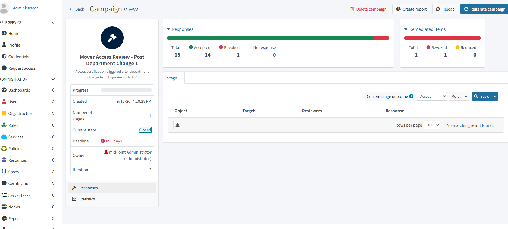
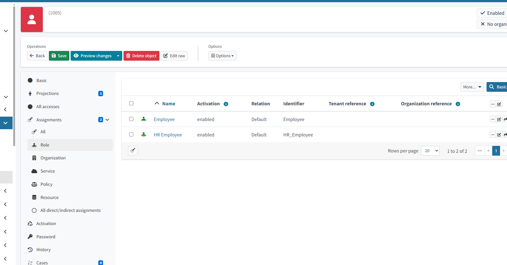

# Access Certification and the Governance Loop

This project demonstrates how access is reviewed and remediated after a department change in MidPoint.

## Campaign Review
Emma moved from Engineering to HR. Her reviewer (Sophie) evaluated her access:
- Employee → Accepted
- HR_Employee → Accepted
- Contractor → Revoked (no longer needed)

## Automated Remediation
After remediation:
- Contractor was removed
- Employee and HR_Employee remained
- Emma’s access now matches her new HR role

## Governance Loop Summary
1. Trigger: Department change  
2. Review: Manager evaluates access  
3. Decision: Contractor revoked  
4. Remediation: MidPoint updates assignments  
5. Audit: Evidence captured in screenshots  

## Screenshots

### Campaign Review

### Assignments After Remediation

