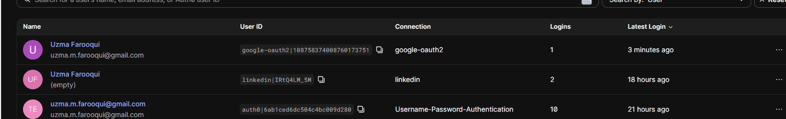
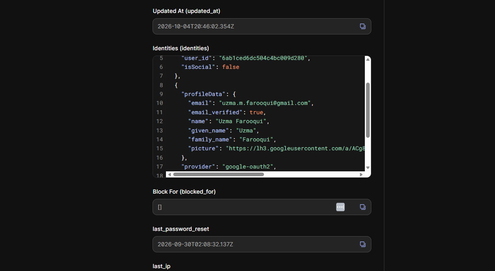

# CIAM Account Linking

<br>

In this lab, I explored account linking in Auth0.

<br>

I created two identities with the same email address:

- Username-Password-Authentication
- Google (google-oauth2)

<br>

Initially, Auth0 created two separate user records. Using the Auth0 Management API, I linked both identities into a single user profile.

<br>

## Before Linking



<br>

The same email address existed as two separate users.

<br>

## After Linking



<br>

Both identities appeared under a single Auth0 profile.

<br>

## What I Learned

- One customer can have multiple identities.
- Account linking creates a single profile across identity providers.
- Linking accounts based only on email can be risky.
- The `email_verified` claim is important when determining whether accounts should be linked.

<br>

## Security Risk

An attacker could create a social account using someone else's email address. If accounts are automatically linked using only the email address, the attacker could gain access to the victim's account.

<br>

To reduce this risk, account linking should only occur when:

```json
"email_verified": true
