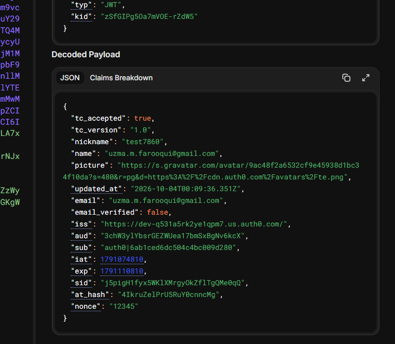

# CIAM Consent (Auth0)

In this lab, I built a Terms & Conditions (T&C) enforcement flow using an Auth0 Post-Login Action.

## Screenshot



## What I Did

- Created a Post-Login Action in Auth0
- Added logic to check whether a user has accepted the Terms & Conditions
- Stored consent information in app_metadata
- Added custom claims to the JWT
- Decoded the JWT and verified the custom claims were present

## How It Works

On a user's first login, the Action allows access and marks that consent is required.

After the user accepts the Terms & Conditions, the application stores the following information in app_metadata:

```json
{
  "tc_accepted": true,
  "tc_version": "1.0",
  "tc_accepted_date": "2026-05-30"
}
```

On future logins, the Action checks these values before allowing access.

## JWT Claims

After the user accepts the Terms & Conditions, the JWT includes custom claims such as:

- tc_accepted
- tc_version

I verified these claims by decoding the token in JWT.io.

## What I Learned

This lab helped me understand:

- How Auth0 Actions work
- How consent can be enforced during authentication
- The difference between user_metadata and app_metadata
- How custom claims are added to JWTs
- How applications use JWT claims to make access decisions
