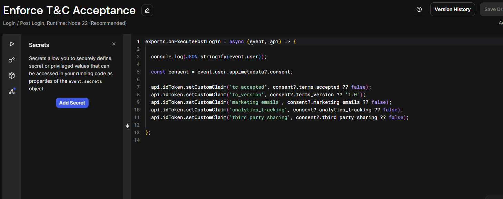
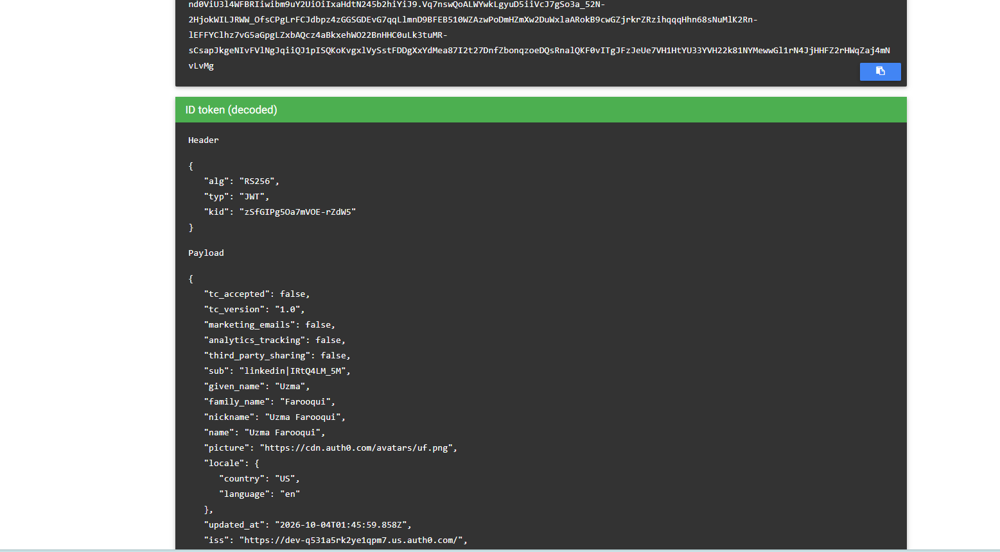

# CIAM Consent (Auth0)

<br>

This lab demonstrates how customer consent can be stored in Auth0 and passed to applications through JWT claims.

<br>

## What I Did

<br>

- Created a Post Login Action in Auth0
- Stored consent preferences in Auth0 `app_metadata`
- Added consent information as custom JWT claims
- Decoded the JWT and verified the claims were present
- Tested how consent changes are reflected in new tokens

<br>

## The Concept

<br>

Instead of storing all consent in a single checkbox, consent was separated into different categories:

- Marketing emails
- Analytics tracking
- Third-party sharing

This allows each consent option to be managed independently.

<br>

## Screenshots

<br>

auth0-app-metadata-consent.png

**App metadata:** Shows the user's consent preferences stored in Auth0.

<br>



**Post Login Action:** Reads consent preferences from `app_metadata` and adds them to the JWT as custom claims.

<br>



**Decoded JWT:** Shows the consent claims added to the token during authentication.

<br>

consent-withdrawal-token.png

**Consent withdrawal:** Shows a newly issued token after consent preferences were updated.

<br>

## How It Works

<br>

The user's consent preferences are stored in Auth0:

```json
{
  "consent": {
    "terms_accepted": true,
    "terms_version": "1.0",
    "marketing_emails": false,
    "analytics_tracking": true,
    "third_party_sharing": false
  }
}
```

<br>

During login, the Post Login Action reads these values and adds them to the JWT as custom claims.

Applications can then use the claims to decide whether certain activities are allowed.

<br>

## Cookie Consent Architecture

<br>

A cookie consent platform such as OneTrust or Cookiebot collects consent choices from the user.

The application stores those preferences in Auth0 `app_metadata`.

During authentication, Auth0 reads the stored consent data and adds it to the JWT.

The JWT is then used by applications and APIs to make privacy and compliance decisions.

```text
Browser
   ↓
Cookie Consent Platform
   ↓
Application
   ↓
Auth0 app_metadata
   ↓
Post Login Action
   ↓
JWT Claims
   ↓
Applications and APIs
```

<br>

## GDPR Article 7

<br>

GDPR requires consent to be specific and easy to withdraw.

Using separate consent categories allows a user to change one preference without affecting the others.

For example, a user can withdraw analytics consent while still keeping access to the application.

<br>

## What I Learned

<br>

This lab helped me understand:

<br>

- How Auth0 Post Login Actions work
- How consent preferences can be stored in `app_metadata`
- How custom JWT claims are created
- How JWTs can carry consent information to applications
- How consent changes can be reflected in newly issued tokens
- Why consent should be managed separately for different purposes
- How GDPR principles relate to CIAM and identity systems

<br>
