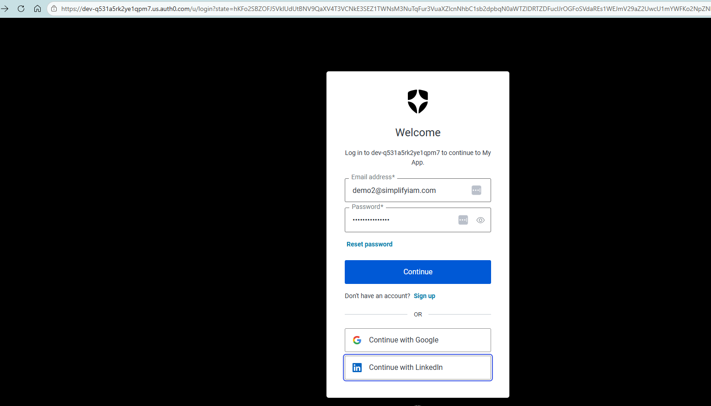
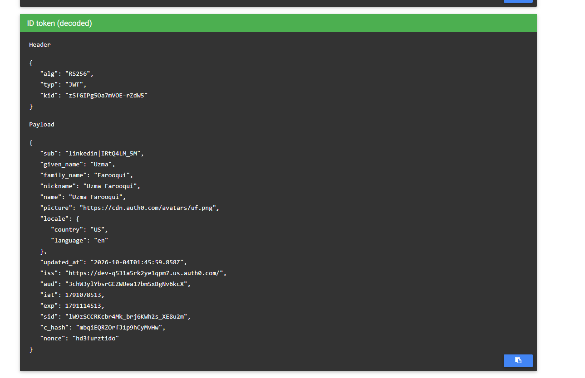

# Federated Identity Chaining (LinkedIn → Auth0)

This lab demonstrates how federated identity works when a user signs into an application using LinkedIn through Auth0.

<br>

### What I Did

- Created a LinkedIn Developer Application
- Enabled Sign In with LinkedIn using OpenID Connect (OIDC)
- Added LinkedIn as a social connection in Auth0
- Enabled the connection for my application
- Authenticated using LinkedIn through OIDC Debugger
- Decoded and analyzed the returned ID token

<br>

### Federated Identity Flow

A user authenticates with LinkedIn, LinkedIn sends identity information to Auth0, and Auth0 issues a new token to the application.

```text
Application → Auth0 → LinkedIn
```

The application never communicates directly with LinkedIn and only trusts Auth0.

<br>

### Screenshots



**LinkedIn login:** User selects the LinkedIn social connection exposed by Auth0 Universal Login.

<br>



**Decoded token:** Shows the ID token issued by Auth0 after successful authentication through LinkedIn.

<br>

### Token Analysis

The decoded token contained:

```json
{
  "sub": "linkedin|IRtQ4LM_5M"
}
```

The `sub` claim identifies:

- The upstream identity provider (`linkedin`)
- The user's unique identifier within LinkedIn

<br>

The token issuer was:

```json
{
  "iss": "https://dev-q531a5rk2ye1qpm7.us.auth0.com/"
}
```

This demonstrates that Auth0 issued the token presented to the application.

Although LinkedIn performed the authentication, the application only trusts Auth0 because Auth0 is the token issuer.

<br>

### Chain of Trust

Federated identity creates a chain of trust between systems.

```text
Application trusts Auth0
Auth0 trusts LinkedIn
LinkedIn authenticates the user
```

The application never validates a LinkedIn token directly and only accepts tokens issued by Auth0.

<br>

### Why the Subject Identifier Matters

The `sub` claim is the most reliable user identifier in OpenID Connect.

Unlike email addresses, subject identifiers are intended to remain stable over time and uniquely identify a user within an identity provider.

```json
{
  "sub": "linkedin|IRtQ4LM_5M"
}
```

This value remains the authoritative identity reference for the authenticated user.

<br>

### Account Linking Challenge

A single user may authenticate using multiple identity providers.

For example:

```text
linkedin|IRtQ4LM_5M
```

and

```text
auth0|6ab1ced6dc504c4bc009d280
```

may represent the same person while appearing as separate identities in Auth0.

<br>

Without account linking, Auth0 treats these as different user accounts.

This is a common Customer Identity and Access Management (CIAM) challenge because each identity provider generates its own unique subject identifier.

<br>

### Why Account Linking Matters

Account linking helps organizations:

- Maintain a single user profile
- Prevent duplicate identities
- Preserve user history and preferences
- Provide a consistent authentication experience
- Simplify identity governance

<br>

### Key Takeaways

- Federated identity uses a chain of trust.
- Applications trust Auth0.
- Auth0 trusts LinkedIn.
- LinkedIn authenticates the user.
- The application only sees tokens issued by Auth0.
- Subject identifiers are more reliable than email addresses.
- Multiple providers may create multiple identities for the same user.
- Account linking requires deliberate design and configuration.

<br>

### Technologies Used

- LinkedIn Developer Platform
- OpenID Connect (OIDC)
- Auth0
- JWT
- OIDC Debugger

<br>

### Learning Outcome

This lab provided hands-on experience with:

- Federated authentication
- Identity brokering
- OpenID Connect
- JWT analysis
- Social identity providers
- CIAM concepts
- Account linking challenges
- Trust relationships between identity systems

<br>
