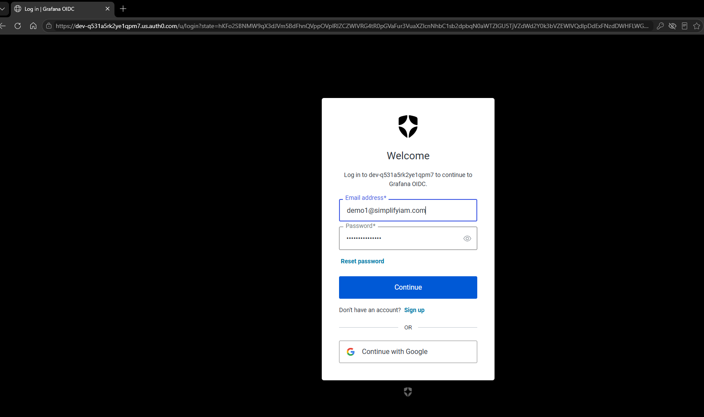
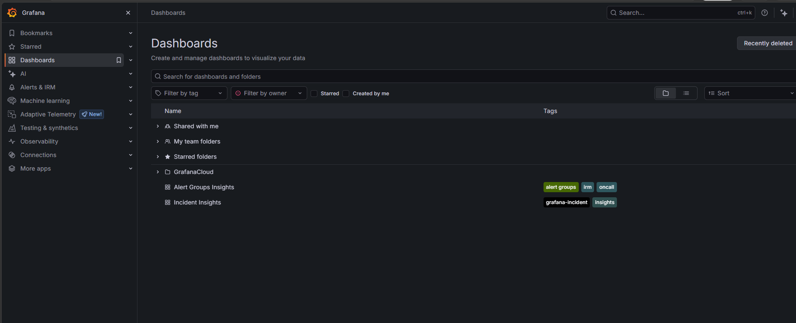

# CIAM Federation Demo (Auth0 → Grafana)

This folder shows my OIDC federation setup where Grafana uses Auth0 as the OpenID Provider.

## Screenshots
### 1. Auth0 Login Page

### 2. Logged Into Grafana Using Auth0

## OIDC Flow
Grafana redirects the user to Auth0, which authenticates the user and returns an ID token.  
The login uses the OIDC Authorization Code Flow with PKCE for secure token exchange.
# OAuth Delegated Authorization Demo (GitHub → SimplifyIAM OAuth Lab)

This section shows my OAuth 2.0 delegated authorization setup where the SimplifyIAM OAuth Lab app requests access to my GitHub profile.

## Screenshots
### 1. GitHub Consent Screen (Requested Scope)
Shows the GitHub OAuth consent page requesting the `read:user` scope.

### 2. Successful API Call to GitHub
Screenshot of the `https://api.github.com/user` response using the access token.

## Delegated Authorization & Scopes
OAuth is delegated authorization. Instead of giving the app my password, I authorize it to act on my behalf with limited permissions.

The `read:user` scope only allows reading my public GitHub profile.  
When I tried to access private repos, GitHub returned nothing because the token did not have permission.

This proves OAuth enforces least privilege:  
**Apps only get exactly what the user approves.**

## Key Difference: OAuth vs OIDC
- **OAuth = Authorization**  
  Controls what the app is allowed to do (e.g., read my profile).

- **OIDC = Authentication**  
  Proves who the user is (e.g., logging into Grafana using Auth0).

OAuth gives access.  
OIDC gives identity.
