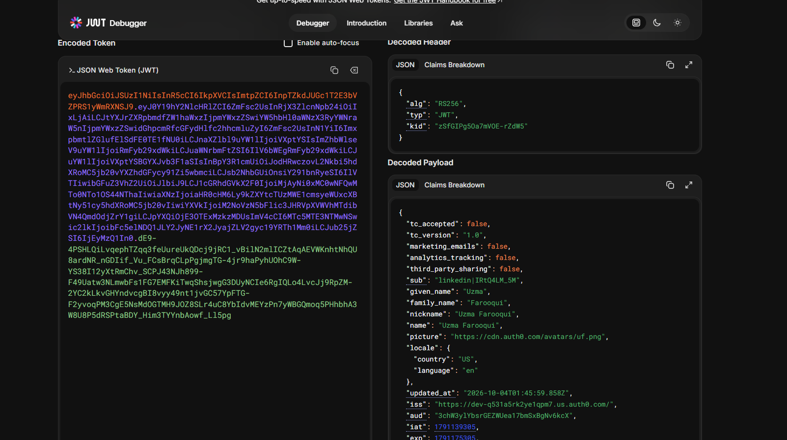
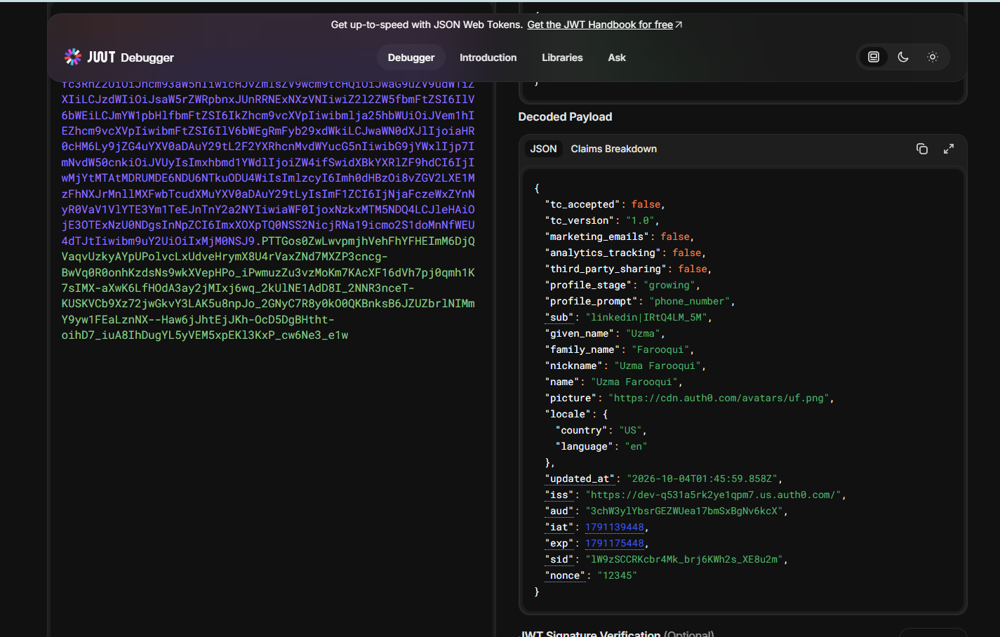

# CIAM UX - Progressive Profiling

In this lab, I explored progressive profiling using Auth0.

I logged in multiple times and decoded the ID token using jwt.io. I noticed the token included custom claims such as:

```json
"profile_stage": "growing",
"profile_prompt": "phone_number"
```

These claims tell the application what information to ask the user for next. Instead of collecting everything during registration, the application gathers information gradually over time.

## What I Learned

- Progressive profiling reduces signup friction.
- The ID token can guide the user journey through custom claims.
- The application can use `profile_prompt` to determine what information to request next.
- User profiles progress through different stages until they are complete.

## Screenshots



