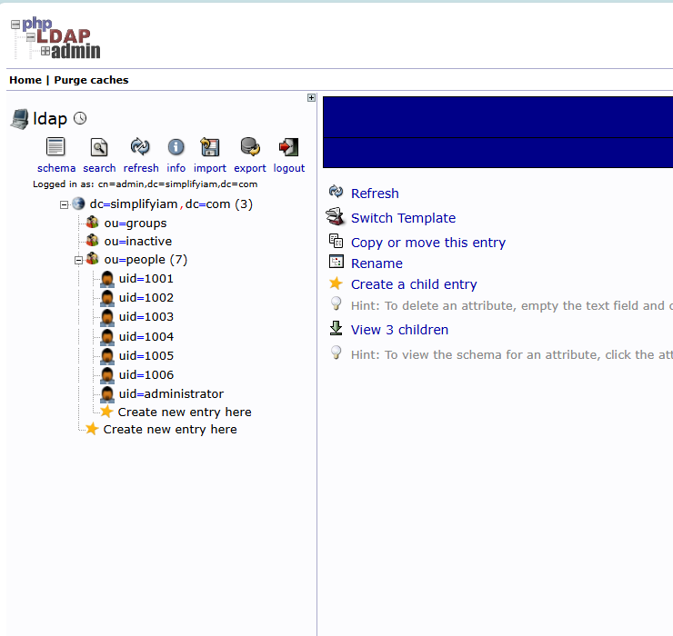
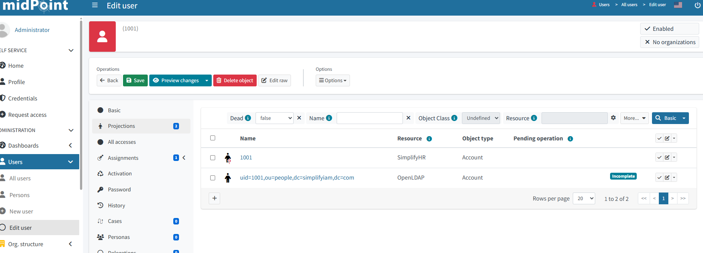
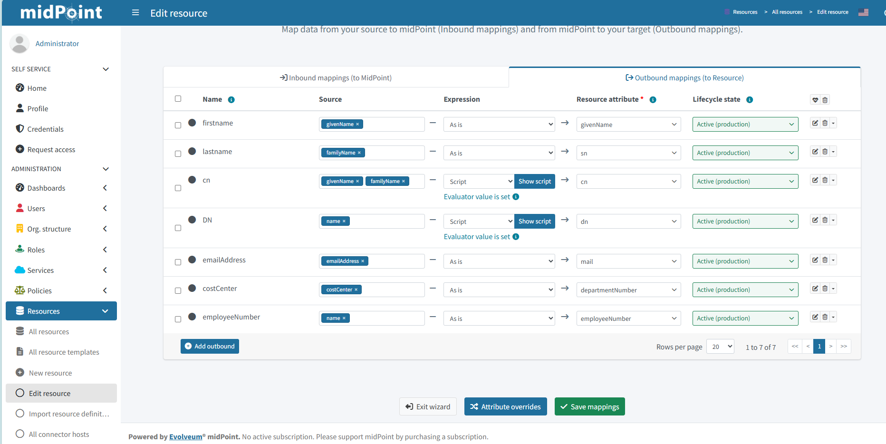
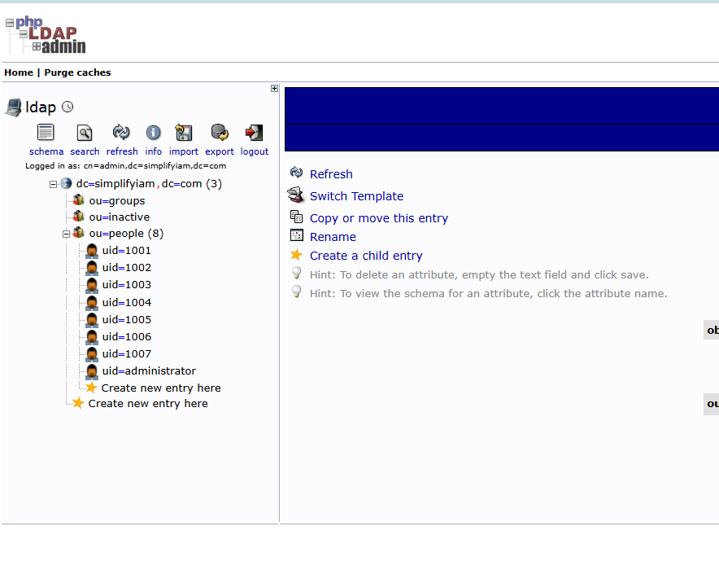
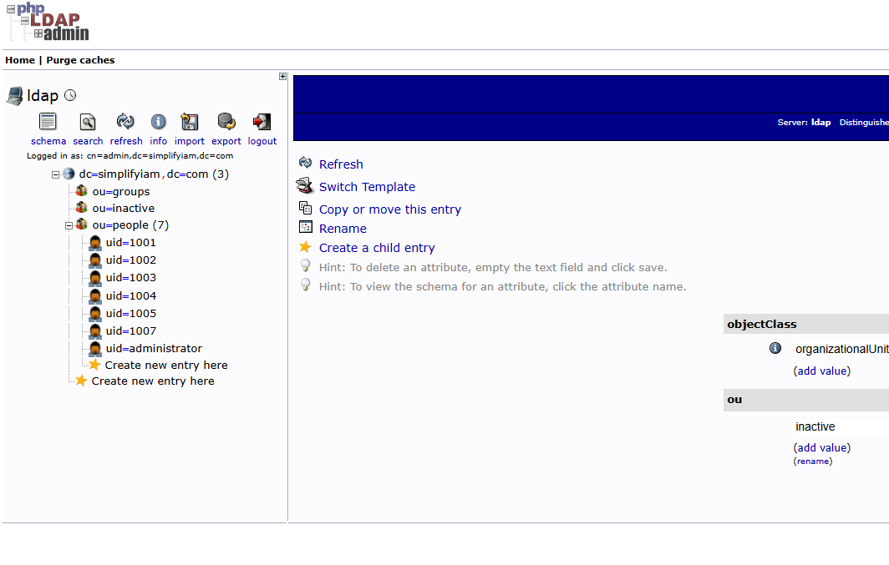

### HR‑driven identity onboarding (source → IGA)
This use case demonstrates how employee data from an HR system flows into an Identity Governance platform, forming the foundation of the joiner–mover–leaver lifecycle.

### Concept
Provisioning automatically creates and updates user accounts based on HR changes.  
Inbound mappings pull attributes from the HR source into midPoint.  
Correlation ensures each HR record links to the correct identity instead of creating duplicates.

These steps ensure identities are consistently created, updated, and governed across systems.

### Screenshots 

**Users page:** Shows the six identities successfully imported from the HR CSV into midPoint. 

**Audit log:** Shows today’s reconciliation events confirming the HR data was read, correlated, and linked to midPoint users.

## Directory provisioning (IGA → LDAP)

This section extends the pipeline beyond HR ingestion, showing how midPoint provisions accounts into OpenLDAP using outbound mappings and DN construction.

### What it is
HR‑driven provisioning from source → IGA → directory.  
midPoint reads HR data, correlates identities, and provisions accounts into OpenLDAP under `ou=people`.

### The concept
Outbound mappings convert midPoint identity attributes into LDAP attributes.  
A Groovy script constructs the DN dynamically based on activation state.  
Assigning the Employee role triggers automatic LDAP account creation.

### Screenshots

  
**phpLDAPadmin:** Shows the six LDAP accounts provisioned by midPoint under `ou=people`.

  
**midPoint projections:** Shows each identity linked to its LDAP account, confirming successful provisioning.
### Artifacts

  
**Outbound mappings:** Shows how midPoint transforms identity attributes into LDAP attributes.

### Joiner–Leaver Lifecycle

This section demonstrates the full identity lifecycle in midPoint, from HR ingestion to LDAP provisioning and termination routing.

#### Joiner
midPoint ingests the HR record, correlates the identity, assigns the Employee role, and provisions an LDAP account under `ou=people`.  
**Result:** 7 accounts visible in phpLDAPadmin.

#### Leaver
On termination, midPoint disables the identity and routes the LDAP account to `ou=inactive` instead of deleting it.  
This preserves the **audit trail**, **role history**, and **lifecycle events** while removing access.  
**Result:** 6 active accounts under `ou=people`.

#### Why routing instead of deletion?
Deleting an identity erases compliance‑critical data. Routing preserves:

- identity history  
- role assignments  
- activation changes  
- provisioning events  
- audit logs  

This mirrors real enterprise IAM behavior.

Centrepiece of the portfolio: a working end‑to‑end lifecycle from **Joiner → Mover → Leaver**.

