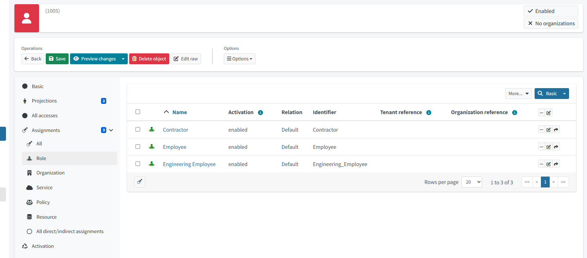

# RBAC Roles

This folder shows how Emma Clarke gets her roles in midPoint. Some roles are given automatically based on her department, and one role is something she requested.

## Emma’s Roles
- **Employee** – everyone gets this automatically.
- **Engineering_Employee** – she gets this because her department is Engineering.
- **Contractor** – this is extra access she asked for; it is not automatic.

## Key Idea
Two of Emma’s roles come from her job, and one role (Contractor) is something she requested. This shows the difference between auto‑assigned access and manually requested access.

## Screenshot

