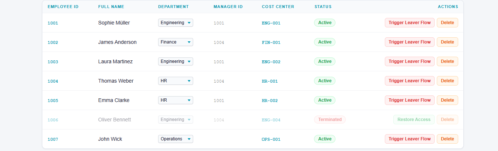
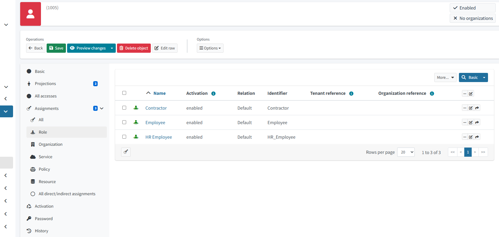

# RBAC Roles

This folder shows how Emma Clarke gets her roles in midPoint. Some roles are given automatically based on her department, and one role is something she requested.

## Emma’s Roles
- **Employee** – everyone gets this automatically.
- **Engineering_Employee** – she gets this because her department is Engineering.
- **Contractor** – this is extra access she asked for; it is not automatic.

## Key Idea
Two of Emma’s roles come from her job, and one role (Contractor) is something she requested. This shows the difference between auto‑assigned access and manually requested access.

## Screenshot

## Department Change

This example shows how midPoint updates a user’s access when their department changes in SimplyHR.

### Before the Change
Emma was in the **Engineering** department, so midPoint auto‑assigned:
- Employee
- Engineering_Employee

She also had a manually requested role:
- Contractor

### HR Update
In SimplyHR, Emma’s department was changed from **Engineering** to **HR**.

### MidPoint Reaction
After reconciling the HR resource and recomputing the user, midPoint updated her department and re‑evaluated her roles.

### After the Change
MidPoint automatically:
- Removed **Engineering_Employee**
- Added **HR_Employee**
- Kept **Employee**
- Kept **Contractor** (because it was manually requested)

This demonstrates how midPoint uses HR data to keep access aligned with job changes.

### HR Change

### After (HR)

